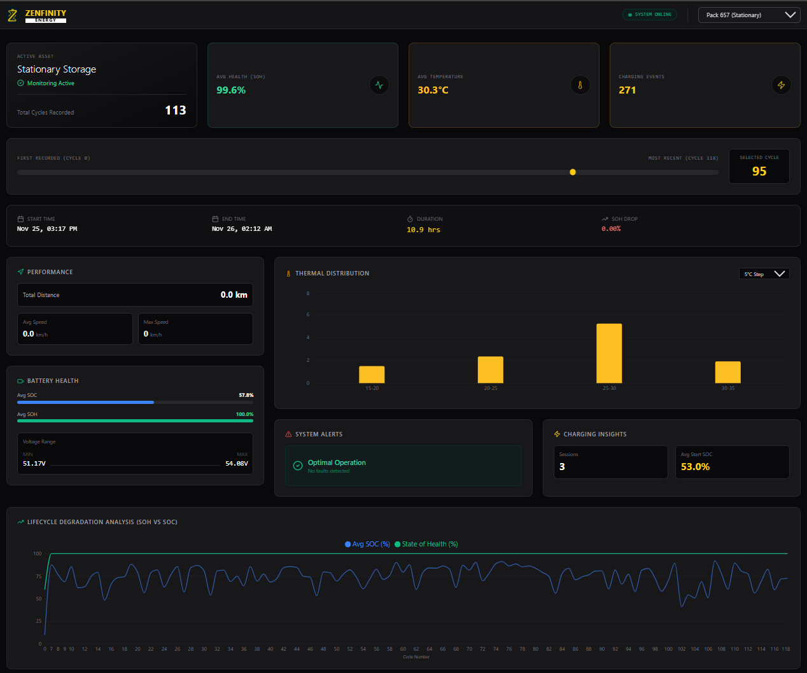

# ⚡ Zenfinity Energy - Battery Analytics Dashboard

A comprehensive telemetry dashboard for analyzing Li-ion battery cycle data. This project was built as part of the Zenfinity Energy Frontend Intern Assessment.

**[🚀 Live Demo](https://zenfinity-battery-dashboard.vercel.app/)** | **[📂 GitHub Repository](https://github.com/A4xMimic/zenfinity-battery-dashboard)**


## 📋 Project Overview

This dashboard visualizes complex battery telemetry data, allowing engineers to monitor the health, performance, and thermal characteristics of battery packs over their entire lifecycle.

**Status:** ✅ 100% of Requirements Met + Advanced Bonus Analysis

### Key Features

#### 1. Data Visualization
* **Interactive Cycle Navigation:** Custom index-based slider allows seamless navigation through the entire history of a battery, handling data gaps gracefully.
* **Industrial HUD Design:** High-contrast "Dark Mode" aesthetic using Zinc/Emerald/Amber tones for clarity in professional environments.
* **Key Performance Indicators (KPIs):** Instant view of Avg SOH, Temperature, and Charging Events.

#### 2. Advanced Analytics (Bonus Implemented)
* **Lifecycle Degradation Analysis:** A long-term trend line chart that overlays **State of Health (SOH)** and **State of Charge (SOC)** across all recorded cycles to visualize degradation patterns.
* **Thermal Distribution:** Interactive Bar Chart with a toggleable sampling rate (**5°C, 10°C, 15°C, 20°C**) to analyze thermal management efficiency.

#### 3. Detailed Metrics
* **Cycle Statistics:** Precise Start/End times, Duration, and SOH drop per cycle.
* **Performance Data:** Tracks Total Distance, Max Speed, and Voltage Min/Max/Avg.
* **Safety & Alerts:** Dedicated panel for monitoring system warnings and protection events.

---

## 🛠️ Tech Stack

* **Framework:** React 18 (Vite)
* **Styling:** Tailwind CSS (Custom "Industrial" Theme)
* **Charts:** Recharts
* **Icons:** Lucide React
* **Deployment:** Vercel

---

## 🏃‍♂️ How to Run Locally

1.  **Clone the repository**
    ```bash
    git clone [https://github.com/A4xMimic/zenfinity-battery-dashboard.git](https://github.com/A4xMimic/zenfinity-battery-dashboard.git)
    cd zenfinity-battery-dashboard
    ```

2.  **Install Dependencies**
    ```bash
    npm install
    ```

3.  **Start the Development Server**
    ```bash
    npm run dev
    ```

4.  **Open in Browser**
    Navigate to `http://localhost:5173` to view the dashboard.
